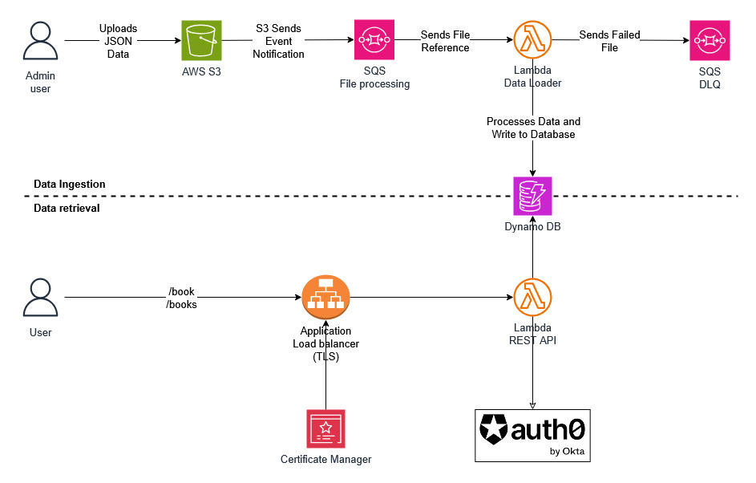

# AWS Lambda based REST API with OAuth
In this example, we create a Lambda based REST API.  We then expose the APIs using AWS Application Load Balancer. 

This application takes advantage of `Serverless`, `Event-driven`, `Secure` architectures.  It allows automated loading of data from S3 to AWS DynamoDB database.  It then creates the `REST APIs` and make those available using a Lambda.  This solution also enables `Batch processing` of data loads and data retrievals to optimize performance.  The system is designed to handle multiple file processing.

This application also secures the API with `OAuth 2.0 Client Credentials Grant for machine-to-machine` workflows. This example uses Auth0.  It also enables `Encryption-In-Transit` by using SSL certificate.

This application is developed using AWS CDK in TypeScript.

## Architecture

## What does it build?
* Creates a S3 bucket for user Data
* Creates a S3 event when new data file is available and Sends to file metadata to a SQS Queue.
* SQS Queue invokes a data processing lambda when new messages are found
  * SQS was added to decouple the system and provide greater autonomy to message processing workflows.
* Creates a Lambda that will process the S3 data and load to AWS DynamoDB.  Duplicated data will update existing records.
  * If the lambda fails to process a file, it will send the file metadata to a SQS Dead Letter Queue (DLQ)
  * A sample file with error is provided
* Creates a DynamoDB table for data persistance
* Creates a Lambda that hostes multiple REST APIs: Single and Bulk
* Configures REST API to use JWT
* Creates an Application Load balancer (with SSL Certificate) to expose the Lambda which returns the REST API responses in JSON payload

## Steps to run and test
* Procure and add the appropriate certificate to AWS ACM, so that we can configure TLS.
* Store Certificate metadata to Secrets Manager so that we can use that for configuring the Application Load Balancer.
* Configure your Identity Provider.  We used Auth0.
* Once the Identity provider is created, add the infromation to SSM and Secrets Manager (Client-Secret), so that we can configure the REST API Lambda to validate JWT.
* Deploy the CDK code. Wait for the deployment to finish.  It will print out the API endpoint for you to use.  For demonstration purpose, we also share a data file that will be uploaded to S3.
* Get the Access token from your Identity Provider
  * 
* Invoke the REST APIs using the Access token
  * 
  * 

### File processing example
* Upload the provided files to S3
* Check SQS file-Upload queue for messages in flight
  * 
* Wait a minute for the erred file information to be sent to DLQ
  * 

## Considerations
* We are using Self-signed Certificate.  Please use a Certificate Provider like Amazon Certificate Manager.
* AWS ALB doesn't support client_credentials. So, we protect the Lambda with JWT directly.
* If you are behind a private network, remember to open the Lambda's Security Group outbound rules to connect to your IDP for validating the token.
* Prefer the use of Amazon Cognito instead of external IDP
* Although this solution supports multiple file processing for this usecase, *it is not optimized for high volume and large files yet*.
* There are many opportunities to simplify this solution

## References
* [Amazon DynamoDB](https://aws.amazon.com/pm/dynamodb/)
* [Amazon Lambda](https://aws.amazon.com/lambda/)
* [Amazon Simple Queue Service](https://aws.amazon.com/sqs/)
* [Amazon Elastic Load Balancer](https://aws.amazon.com/elasticloadbalancing/)
* [Amazon S3](https://aws.amazon.com/s3/)
* [Amazon Certificate Manager](https://aws.amazon.com/certificate-manager/)
* [Auth0](https://auth0.com)
